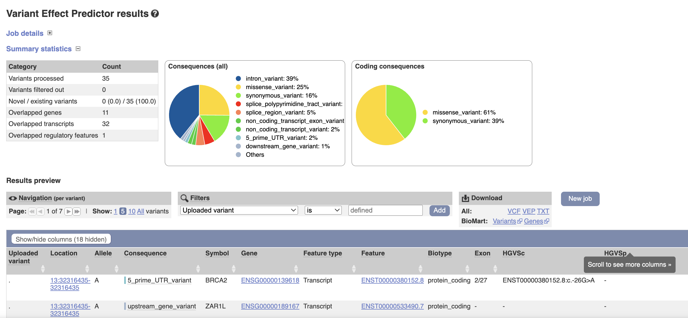

# VCF Annotation

**VEP** stands for **Variant Effect Predictor**. It’s a tool developed by **Ensembl** that helps researchers and clinicians predict the functional effects of genetic variants (like SNPs, insertions, deletions) on genes, transcripts, and proteins. Essentially, it tells you what impact a DNA change might have, such as whether it alters a protein, affects a splice site, or is likely benign.

### **Three main modes to use VEP:**

1. **Web Interface (Online)**

   * Accessible through the Ensembl website.
   * User-friendly, no installation required.
   * Suitable for small datasets or quick analyses.
   * You just upload your variant file or input variants manually.

2. **REST API**

   * Allows programmatic access to VEP from scripts or applications.
   * Useful for integrating VEP into pipelines or web applications.
   * Can handle automated queries without manual interaction.
   * Returns results in formats like JSON or XML.

3. **Command Line (Offline)** - partially covered in the tutorial

   * Installed locally on your computer or server.
   * Best for large datasets or high-throughput analyses.
   * Allows more customization (plugins, caching, multiple options for output formats).
   * Requires some knowledge of command-line operations.


## 1. **Web Interface (Online)**

Use the `data/variants/HG00152_male_SRR769545_filtered.vcf` and upload them to [VEP Online](https://www.ensembl.org/Tools/VEP). Before starting annotation, you can configure a lot of parameters, such as:

* **Consequence types**: Filter results to specific types of variant consequences (e.g., missense, synonymous, stop-gained).
* **Gene and transcript sets**: Choose specific gene sets or transcript versions (like Ensembl canonical transcripts).
* **Frequency and pathogenicity data**: Include population frequency data (gnomAD, 1000 Genomes) and clinical annotations (ClinVar).
* **Effect predictors**: Include tools like REVEL, AlphaMissense, SIFT, PolyPhen.

Once configured, you can run the annotation, download the results, and interpret the predicted effects of the variants on genes, transcripts, and proteins.



The equivalent offline call using all the set params (assumes offline installation of VEP not fully covered in the tutorial):

```bash
./vep --af --af_gnomade --appris --biotype --buffer_size 500 --canonical --check_existing --check_frequency --custom file=https://ftp.ensembl.org[path_to]/gencode.v48.promoter_windows_sorted.gff3.gz,format=gff,short_name=GENCODE_promoter,type=overlap,gff_type=gencode_promoter --distance 5000 --freq_filter exclude --freq_freq 0.01 --freq_gt_lt gt --freq_pop 1kg_all --gencode_primary --hgvs --mane --numbers --pick --plugin SpliceAI,snv=[path_to]/spliceai_scores.raw.snv.ensembl_mane.grch38.110.vcf.gz,indel=[path_to]/spliceai_scores.masked.indel.hg38.vcf.gz,snv_ensembl=[path_to]/spliceai_scores.raw.snv.ensembl_mane.grch38.110.vcf.gz --plugin AlphaMissense,file=[path_to]/AlphaMissense_hg38.tsv.gz --plugin EVE,file=[path_to]/eve_merged.vcf.gz --plugin REVEL,file=[path_to]/new_tabbed_revel_grch38.tsv.gz --plugin GO,[path_to]/ --plugin NMD --plugin Enformer,file=[path_to]/enformer_grch38.vcf.gz --plugin CADD,snv=[path_to]/spliceai_scores.raw.snv.ensembl_mane.grch38.110.vcf.gz,indels=[path_to]/CADD_GRCh38_1.7_InDels.tsv.gz --polyphen b --pubmed --regulatory --show_ref_allele --sift b --species homo_sapiens --symbol --transcript_version --tsl --uploaded_allele --cache --input_file [input_data] --output_file [output_file]
```

## 2. **REST API**

The documentation of the REST API you can find it [here](https://rest.ensembl.org/#VEP). Below we will do a REST call using the substitution `chr13:32332592 A>C` in the `HG00152_male_SRR769545`. 

```bash
wget -q --header='Content-type:application/json' 'https://rest.ensembl.org/vep/human/region/13:32332592-32332592/C?'  -O -
```

Output:

```
[{"end":32332592,"id":"13_32332592_A/C","assembly_name":"GRCh38","colocated_variants":[{"strand":1,"allele_string":"HGMD_MUTATION","seq_region_name":"13","phenotype_or_disease":1,"start":32332592,"id":"CM002750","end":32332592},{"phenotype_or_disease":1,"id":"COSV66448817","end":32332592,"start":32332592,"strand":1,"somatic":1,"allele_string":"COSMIC_MUTATION","var_synonyms":{"COSMIC":["COSM147663"]},"seq_region_name":"13"},{"phenotype_or_disease":1,"clin_sig":["uncertain_significance","not_provided","benign","likely_benign"],"pubmed":[25741868,24728327,21514219,20003265,33126731,22253860,16857995,18547414,18830263,21296624,19902366,22703879,29458332,19276285,24062231,18974877,18086758,18431743,19500380,18579371,15113441,29209986,28418863,22532573,19138047,21987080,25178586,22875147,29963112,22430443,30677706,22513257,12466288,17428325,35637613,21161372,11062481,11927503,14555511,15235023,17767707,19644020,20135345,23961350,24323938,26979245,27478808,28415599,33499154,34008499,23767878,23451180,18694767,33643918,34295994,23313170,25802882,26496279,24052750,35870994,19383379,25653542,28418854,35908255,19012493,32284662,29891014,29921024,29657992,31938277,29884136,18059179,29785135,35456488,37204320,23964347,31131559,33162799,35510381,34242281,34367235,28076423,32579544,33357097,22065914,33507988,29997359,24289560,31962039,26052455,25923920,34758846,18062861,17182175,37804357,38156855,38019249,39135053,39335675,39660349,39803660,39710803,39926850],"start":32332592,"clin_sig_allele":"T:uncertain_significance;C:benign;C:uncertain_significance;T:likely_benign;G:conflicting_classifications_of_pathogenicity;G:uncertain_significance","end":32332592,"id":"rs144848","strand":1,"seq_region_name":"13","frequencies":{"C":{"gnomade_amr":0.302,"eur":0.2952,"amr":0.2997,"gnomadg_amr":0.304,"gnomadg_asj":0.3603,"gnomade":0.2805,"gnomadg_sas":0.3577,"gnomade_mid":0.3008,"gnomade_asj":0.3532,"gnomadg_eas":0.2581,"gnomadg_ami":0.295,"gnomade_sas":0.3494,"eas":0.2847,"gnomadg_fin":0.2215,"gnomadg_afr":0.1252,"gnomade_afr":0.1253,"afr":0.084,"af":0.2494,"gnomadg_mid":0.2603,"gnomadg":0.2379,"gnomadg_nfe":0.2764,"gnomadg_remaining":0.2666,"sas":0.3538,"gnomade_eas":0.2363,"gnomade_remaining":0.276,"gnomade_fin":0.232,"gnomade_nfe":0.2814}},"var_synonyms":{"ClinVar":["RCV000112880","VCV000125934","RCV004802930","RCV002476952","RCV000130720","RCV000207052","RCV000260146","RCV000320173","RCV000468776","RCV000034427","RCV000009916","VCV000009329","RCV000120303","RCV000768560","RCV001017368","VCV000822206","RCV001319297","RCV003157240","RCV002805842","VCV001990787"],"UniProt":["VAR_005094"],"OMIM":[600185.0013]},"allele_string":"A/C/G/T"}],"strand":1,"transcript_consequences":[{"cds_end":1114,"amino_acids":"N/H","variant_allele":"C","strand":1,"biotype":"protein_coding","codons":"Aat/Cat","cds_start":1114,"sift_score":0.04,"consequence_terms":["missense_variant"],"transcript_id":"ENST00000380152","gene_id":"ENSG00000139618","sift_prediction":"deleterious","polyphen_score":0.003,"gene_symbol":"BRCA2","protein_end":372,"polyphen_prediction":"benign","cdna_start":1313,"gene_symbol_source":"HGNC","cdna_end":1313,"impact":"MODERATE","hgnc_id":"HGNC:1101","protein_start":372},{"cds_start":1114,"codons":"Aat/Cat","variant_allele":"C","amino_acids":"N/H","strand":1,"biotype":"nonsense_mediated_decay","cds_end":1114,"sift_score":0.04,"gene_id":"ENSG00000139618","sift_prediction":"deleterious","polyphen_score":0.003,"transcript_id":"ENST00000470094","consequence_terms":["missense_variant","NMD_transcript_variant"],"cdna_start":1313,"impact":"MODERATE","gene_symbol_source":"HGNC","cdna_end":1313,"hgnc_id":"HGNC:1101","protein_start":372,"polyphen_prediction":"benign","protein_end":372,"gene_symbol":"BRCA2"},{"sift_score":0.05,"cds_end":1114,"variant_allele":"C","amino_acids":"N/H","strand":1,"biotype":"nonsense_mediated_decay","codons":"Aat/Cat","cds_start":1114,"gene_symbol":"BRCA2","protein_end":372,"polyphen_prediction":"benign","cdna_start":1313,"cdna_end":1313,"gene_symbol_source":"HGNC","hgnc_id":"HGNC:1101","impact":"MODERATE","protein_start":372,"consequence_terms":["missense_variant","NMD_transcript_variant"],"transcript_id":"ENST00000528762","gene_id":"ENSG00000139618","polyphen_score":0.003,"sift_prediction":"deleterious"},{"transcript_id":"ENST00000530893","sift_prediction":"deleterious","gene_id":"ENSG00000139618","polyphen_score":0.003,"consequence_terms":["missense_variant"],"polyphen_prediction":"benign","cdna_start":1312,"hgnc_id":"HGNC:1101","gene_symbol_source":"HGNC","cdna_end":1312,"protein_start":249,"impact":"MODERATE","gene_symbol":"BRCA2","protein_end":249,"codons":"Aat/Cat","cds_start":745,"cds_end":745,"variant_allele":"C","amino_acids":"N/H","biotype":"protein_coding","strand":1,"sift_score":0.04},{"cds_end":1114,"strand":1,"biotype":"protein_coding","variant_allele":"C","amino_acids":"N/H","codons":"Aat/Cat","cds_start":1114,"sift_score":0.04,"consequence_terms":["missense_variant"],"transcript_id":"ENST00000544455","polyphen_score":0.003,"gene_id":"ENSG00000139618","sift_prediction":"deleterious","gene_symbol":"BRCA2","protein_end":372,"polyphen_prediction":"benign","cdna_end":1213,"gene_symbol_source":"HGNC","hgnc_id":"HGNC:1101","impact":"MODERATE","protein_start":372,"cdna_start":1213},{"consequence_terms":["missense_variant","NMD_transcript_variant"],"transcript_id":"ENST00000614259","polyphen_score":0.005,"gene_id":"ENSG00000139618","sift_prediction":"tolerated","gene_symbol":"BRCA2","protein_end":372,"polyphen_prediction":"benign","cdna_start":1114,"gene_symbol_source":"HGNC","hgnc_id":"HGNC:1101","protein_start":372,"impact":"MODERATE","cdna_end":1114,"cds_end":1114,"variant_allele":"C","amino_acids":"N/H","biotype":"nonsense_mediated_decay","strand":1,"codons":"Aat/Cat","cds_start":1114,"sift_score":0.05},{"sift_prediction":"deleterious","gene_id":"ENSG00000139618","polyphen_score":0.003,"transcript_id":"ENST00000665585","consequence_terms":["missense_variant","NMD_transcript_variant"],"gene_symbol_source":"HGNC","protein_start":372,"hgnc_id":"HGNC:1101","cdna_end":1313,"impact":"MODERATE","cdna_start":1313,"polyphen_prediction":"benign","protein_end":372,"gene_symbol":"BRCA2","cds_start":1114,"codons":"Aat/Cat","strand":1,"biotype":"nonsense_mediated_decay","amino_acids":"N/H","variant_allele":"C","cds_end":1114,"sift_score":0.05},{"consequence_terms":["missense_variant","NMD_transcript_variant"],"transcript_id":"ENST00000666593","gene_id":"ENSG00000139618","polyphen_score":0.003,"sift_prediction":"deleterious","gene_symbol":"BRCA2","protein_end":372,"polyphen_prediction":"benign","gene_symbol_source":"HGNC","hgnc_id":"HGNC:1101","cdna_end":1313,"impact":"MODERATE","protein_start":372,"cdna_start":1313,"cds_end":1114,"strand":1,"biotype":"nonsense_mediated_decay","variant_allele":"C","amino_acids":"N/H","codons":"Aat/Cat","cds_start":1114,"sift_score":0.04},{"codons":"Aat/Cat","cds_start":1114,"cds_end":1114,"strand":1,"biotype":"protein_coding","variant_allele":"C","amino_acids":"N/H","sift_score":0.04,"transcript_id":"ENST00000680887","sift_prediction":"deleterious","gene_id":"ENSG00000139618","polyphen_score":0.003,"consequence_terms":["missense_variant"],"polyphen_prediction":"benign","gene_symbol_source":"HGNC","cdna_end":1239,"impact":"MODERATE","protein_start":372,"hgnc_id":"HGNC:1101","cdna_start":1239,"gene_symbol":"BRCA2","protein_end":372},{"transcript_id":"ENST00000700201","gene_id":"ENSG00000139618","strand":1,"consequence_terms":["3_prime_UTR_variant","NMD_transcript_variant"],"biotype":"nonsense_mediated_decay","variant_allele":"C","gene_symbol_source":"HGNC","cdna_end":1405,"hgnc_id":"HGNC:1101","impact":"MODIFIER","cdna_start":1405,"gene_symbol":"BRCA2"},{"sift_score":0.04,"cds_start":1114,"codons":"Aat/Cat","variant_allele":"C","amino_acids":"N/H","strand":1,"biotype":"protein_coding","cds_end":1114,"cdna_start":1313,"gene_symbol_source":"HGNC","impact":"MODERATE","protein_start":372,"cdna_end":1313,"hgnc_id":"HGNC:1101","polyphen_prediction":"benign","protein_end":372,"gene_symbol":"BRCA2","gene_id":"ENSG00000139618","sift_prediction":"deleterious","polyphen_score":0.003,"transcript_id":"ENST00000700202","consequence_terms":["missense_variant"]},{"gene_symbol":"BRCA2","impact":"MODIFIER","gene_symbol_source":"HGNC","hgnc_id":"HGNC:1101","cdna_end":1321,"cdna_start":1321,"consequence_terms":["3_prime_UTR_variant","NMD_transcript_variant"],"biotype":"nonsense_mediated_decay","strand":1,"variant_allele":"C","transcript_id":"ENST00000713677","gene_id":"ENSG00000139618"},{"cds_start":1114,"codons":"Aat/Cat","biotype":"protein_coding","strand":1,"variant_allele":"C","amino_acids":"N/H","cds_end":1114,"sift_score":0.04,"gene_id":"ENSG00000139618","sift_prediction":"deleterious","transcript_id":"ENST00000713678","consequence_terms":["missense_variant"],"gene_symbol_source":"HGNC","impact":"MODERATE","protein_start":372,"cdna_end":1325,"hgnc_id":"HGNC:1101","cdna_start":1325,"protein_end":372,"gene_symbol":"BRCA2"},{"sift_score":0.05,"codons":"Aat/Cat","cds_start":1114,"cds_end":1114,"strand":1,"biotype":"nonsense_mediated_decay","amino_acids":"N/H","variant_allele":"C","protein_start":372,"gene_symbol_source":"HGNC","cdna_end":1313,"hgnc_id":"HGNC:1101","impact":"MODERATE","cdna_start":1313,"gene_symbol":"BRCA2","protein_end":372,"transcript_id":"ENST00000713679","sift_prediction":"tolerated","gene_id":"ENSG00000139618","consequence_terms":["missense_variant","NMD_transcript_variant"]},{"consequence_terms":["missense_variant"],"transcript_id":"ENST00000713680","sift_prediction":"deleterious","gene_id":"ENSG00000139618","gene_symbol":"BRCA2","protein_end":372,"gene_symbol_source":"HGNC","protein_start":372,"cdna_end":1313,"hgnc_id":"HGNC:1101","impact":"MODERATE","cdna_start":1313,"cds_end":1114,"biotype":"protein_coding","strand":1,"amino_acids":"N/H","variant_allele":"C","codons":"Aat/Cat","cds_start":1114,"sift_score":0.04}],"allele_string":"A/C","most_severe_consequence":"missense_variant","input":"13 32332592 32332592 A/C 1","seq_region_name":"13","start":32332592}]
```

You can visualize this JSON response in a tool like [JSON Viewer](https://jsonformatter.org/json-viewer).

## 3. **Command Line (Offline)**

```bash
mamba create -n vep -c conda-forge -c bioconda ensembl-vep

# download VEP for hg38 -> this requires around 30 GB of space
<path>/miniforge3/envs/vep/share/ensembl-vep-115.2-1/vep_install  -a c -s homo_sapiens -y GRCh38 --AUTO c --CACHEDIR $PWD/.vep
```

This first intallation steps do not include the plugins. These would need to be installed separately.

